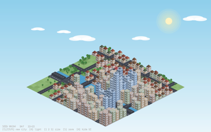
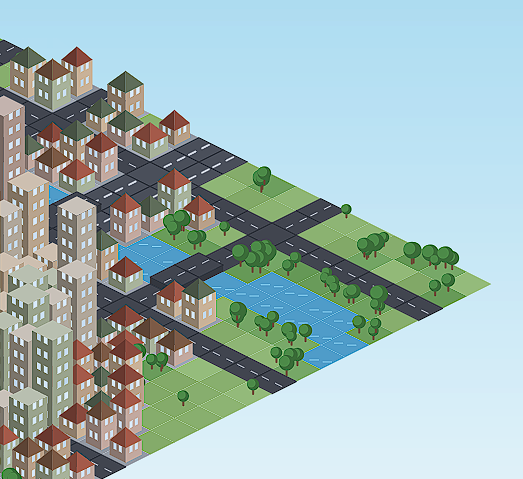
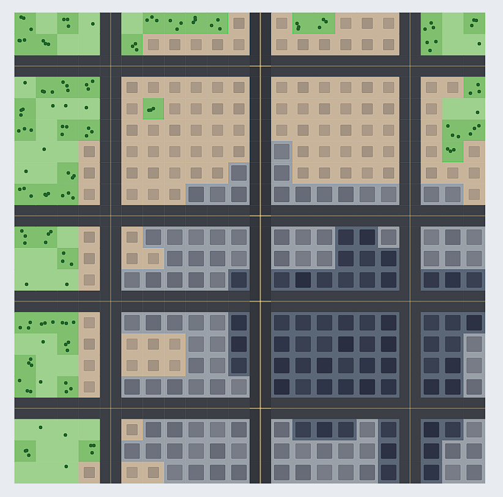
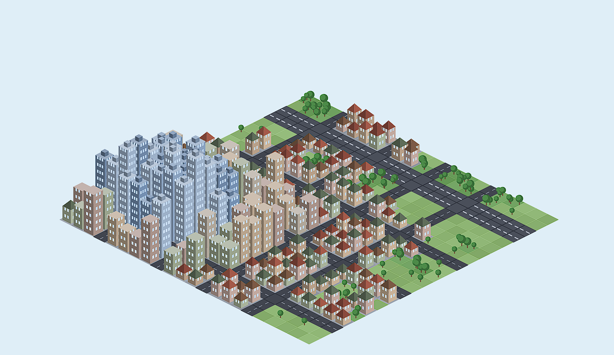
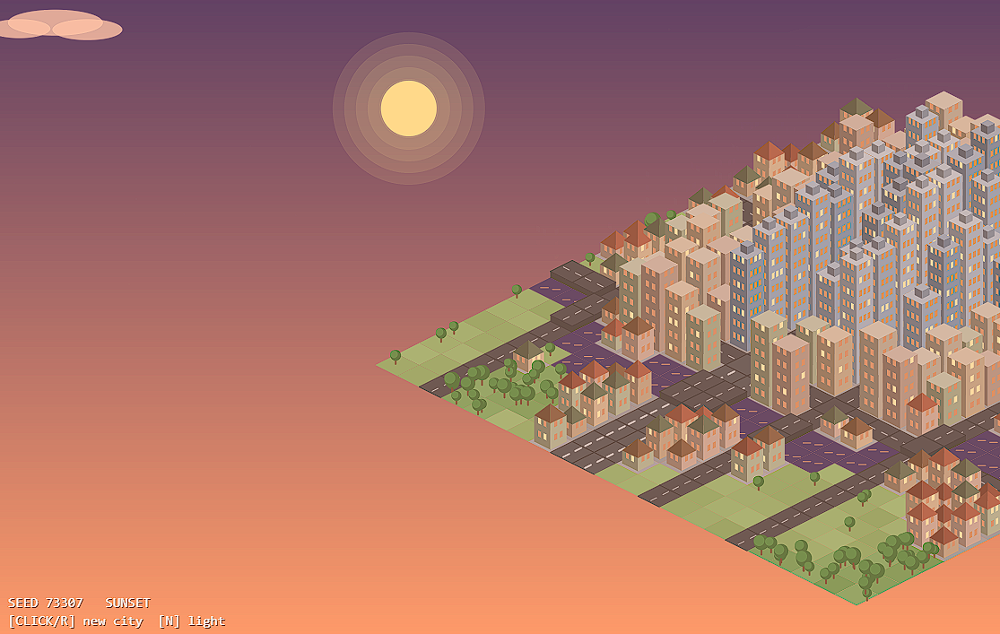
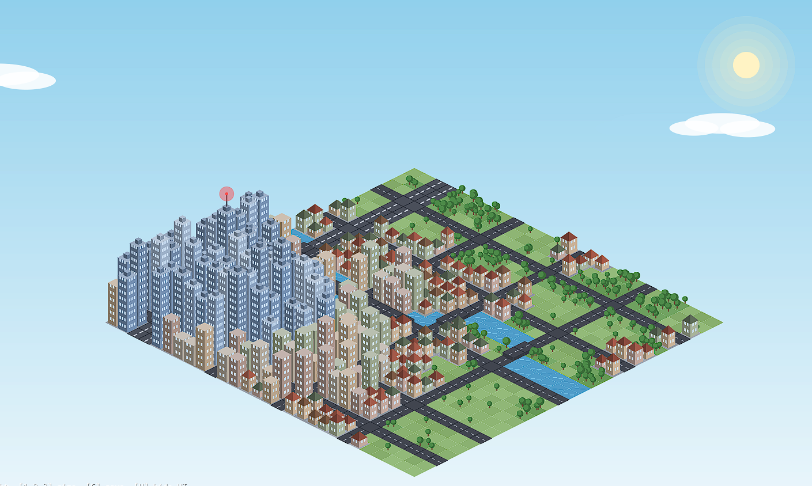
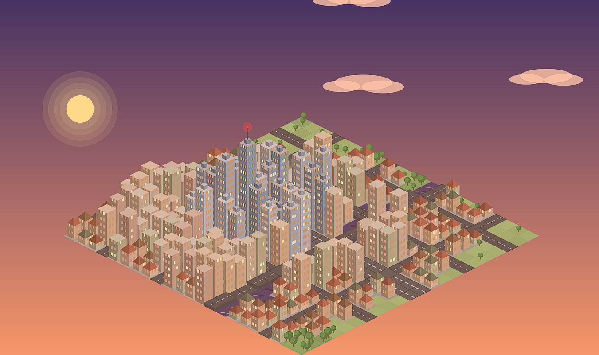
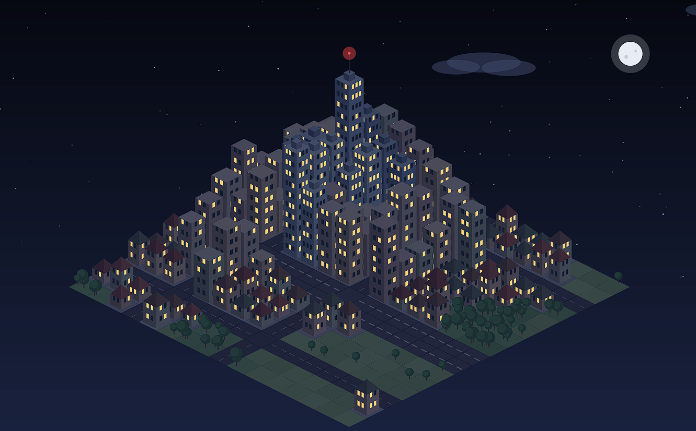

# Experiment 2 - A city generator, with at least 3 distinct types of building/land.

## Brief
I have created interactive 3D city generator with 3 types of builfings and land - Procedural City.

## Description
This is isometric city generator. Each time it runs, it produces a unique but fairly believable town.

My starting version used a 10 × 10 grid where every cell was assigned `floor(random(3))`. This produced either a skyscraper, a road or a park, but there was no system behind their placement. It looked more like a collection of random shapes than a city.
  

  

 
I decided to control the randomness with a small set of planning rules. The city is generated in layers. First of all, the program creates an irregular street grid, with gaps of four to seven cells between roads. One road is widened into a two-lane avenue with centre-line markings. In about half of the generated cities, a river crosses the map. Its path bends using Perlin noise, and a raised bridge is automatically added wherever the river meets a road.
  

  

 
The program then selects a downtown point near a road intersection. Each available cell receives a density value based on its distance from this centre, a Perlin noise value and a bonus for being next to a road. This density controls the zoning. The busiest areas receive glass towers, followed by mid-rise blocks, private houses with roofs, parks and open grass. Parks are also more likely next to the river. Buildings on downtown corner plots receive extra floors, while the densest point becomes a landmark tower with an antenna and blinking beacon (Shiffman, 2016; p5.js Contributors, n.d.).

The city is drawn using isometric projection. Cells are rendered from back to front, and buildings have three faces with slightly different levels of brightness. Window states are calculated using a hash based on the cell, floor, building face and seed. This means that windows remain lit or dark instead of changing whenever the frame is redrawn.

There are three lighting modes: day, sunset and night. Pressing `N` changes the lighting without generating a new layout. At night, stars appear and some windows become warm yellow. The city and sky are rendered into separate `createGraphics()` buffers, so only the clouds and landmark beacon need to be animated every frame (p5.js Contributors, n.d.). This keeps the sketch responsive even when using the largest 28 × 28 grid.

### The controls are:
- Click or press `R` to generate a new city.
- Press `N` to switch between day, sunset and night.
- Press `1`, `2` or `3` to select a 16 × 16, 22 × 22 or 28 × 28 grid.
- Press `S` to save a PNG screenshot.
- Press `H` to hide the interface.

The seed is displayed in the corner, making it possible to return to a city that produced an interesting result.

## Techniques used
* Layered procedural generation: streets, river, downtown, density field, zoning and a final variety check.
* Perlin `noise()` for the river path and changes in building density.
* `randomSeed()` and `noiseSeed()` to make each city reproducible from its seed.
* A deterministic hash based on the fractional part of `sin()` for windows and smaller details. This avoids relying on the order of calls to `random()`.
* Isometric projection, converting grid coordinates `(i, j)` into screen positions.
* The painter’s algorithm, drawing cells by diagonals of `i + j` from back to front.
* A shared `light()` function that changes the colour of every material for day, sunset and night.
* Three differently shaded building faces to suggest a light source.
* Off-screen `createGraphics()` buffers for the sky and city, with clouds and the beacon animated above them.
* Placement rules for intersection height bonuses, waterfront parks and bridges at road-and-water crossings.
* An `ensureVariety()` pass that checks whether every main building or land type has been generated.
* Interactive control of the seed, grid size and time of day, as well as screenshot saving and interface hiding.

## Development Process
I developed the generator across five standalone versions. Each version still runs independently, so the change from random rectangles to a rule-based city can be seen clearly.

In `city-gen_v1_baseline.js`, the program creates a 10 × 10 grid and gives every cell one of three random values. A skyscraper and a single-storey building are represented by flat rectangles in different colours. Every park contains the same three tree dots. The sketch also calls `noLoop()` after its first frame. Although it runs, the result reads as visual noise. Looking at this version helped me identify the main tasks: separating the city data from its rendering, generating the layout in stages, making results reproducible and keeping `draw()` active for later animation.

For `city-gen_v2_flat_zoning.js`, I kept the flat view but replaced random placement with a set of layered rules. This made the planning decisions easier to see before attempting the isometric design. I first tested a street grid with equal spacing, but it looked too mechanical. The irregular four-to-seven-cell spacing gave the layout more variation, and one road was turned into an avenue.
  

  

 
A downtown point was then selected near the centre. Distance from this point, Perlin noise and road access were combined into a density value. Thresholds turned this value into towers, mid-rise buildings, houses, parks or grass. The seed was also shown on screen, so I could regenerate a city that worked well. Tree positions originally used `random()` inside `draw()`, which caused them to flicker. Replacing this with a deterministic hash kept the details fixed. Floor values were already stored in the city data, but the flat view could only represent them using darker building footprints. This limitation led directly to the isometric version.

In `city-gen_v3_isometric.js`, the same city data was given height. Grid coordinates were converted into isometric screen coordinates, and cells were drawn by diagonals of `i + j`. My first drawing order caused buildings to overlap incorrectly. Drawing from back to front with the painter’s algorithm fixed this problem.
  

  

 
Buildings were extruded according to their floor count. Their left face is darker, the right face is lighter and the roof is brighter. Houses received gabled roofs, while towers received rooftop units. Window states used the same deterministic hash as the earlier tree positions, now including the cell, floor and face. At this stage, the scene was still redrawn directly on every frame. This was manageable with a 22 × 22 grid, but it would become inefficient once the environment and larger grid sizes were added.

`city-gen_v4_environment.js` introduced the river, bridges and lighting modes. A river appears in about 45% of generated cities and bends according to Perlin noise. When it crosses a road, that cell becomes a raised bridge. Without this rule, the river simply divided the road system and made the city feel disconnected.
  

  

 
I used one `light()` function to tint all materials for day, sunset or night. Window colours also respond to the selected mode: they appear as glass during the day, a few become warm at sunset, and roughly half are lit at night. Pressing `N` changes the lighting without rebuilding the city because generation and rendering are now separate. The sky and city are drawn once into off-screen buffers, leaving `draw()` to combine them and animate the clouds.

In `city-gen_v5_final.js`, I added more control and made the generated results more reliable. Towers and mid-rise buildings at downtown intersections receive extra floors, although height caps prevent them from becoming too tall. Waterfront cells are more likely to become parks. The `ensureVariety()` function checks the completed map and makes small corrections if a city has no towers, mid-rise buildings, houses or parks.
  

  
  
  

 
I tried several other visual ideas during development:
* I added drop shadows to the ground, but they interfered with the isometric drawing order and made the scene look untidy. The contrast between the three building faces and the lighting modes worked better.
* I tested fully random façade colours. The result looked too bright and inconsistent, so I used four muted colour choices for each building type and applied the global lighting on top.
* I began with roads at regular intervals, but this made every city look too similar. Irregular spacing and a single avenue produced a less rigid layout.

### Problems handled
* Several problems became clear while I was working through the different versions. The first was the use of `floor(random(3))` for every cell. Although this produced variation, the result looked like noise rather than a planned city. It was also impossible to recreate a particular layout. I replaced this approach with seeded generation and divided the process into separate stages: streets, downtown placement, density calculation and zoning. The seed is displayed on screen, so any successful result can be generated again.
* Another issue appeared when I used `random()` to position small details inside `draw()`. These details changed every frame and caused visible flickering. I solved this by using a deterministic hash based on the cell coordinates and seed. The same inputs always produce the same result, so windows, trees and other details stay in place.
* The flat version already stored the number of floors for each building, but it could only represent this information through darker footprints. Moving to an isometric view allowed the buildings to be given real height. I used their stored floor values to extrude them and added differently shaded faces and roofs. At first, the buildings overlapped in the wrong order. Drawing the cells from back to front along diagonals of `i + j` fixed this.
* Adding the river created a different problem because it cut through roads and separated parts of the city. I changed any cell containing both road and water into a raised bridge. Performance also became more noticeable once I introduced larger grids and a detailed sky. Instead of redrawing the whole scene every frame, I rendered the static sky and city into separate buffers. Only the clouds and landmark beacon continue to animate.
* Some generated cities were still missing important elements, such as parks or towers. The `ensureVariety()` pass checks the completed layout and makes small changes where necessary. The skylines could also feel quite similar, even when their layouts were different. To give each city a clearer focal point, the densest tower receives extra height, an antenna and a blinking beacon.

## Reflection
Several parts worked well. Most importantly, the output reads as a city rather than a random grid. Buildings follow the roads, the centre is denser, and the avenue and landmark help organise the view. The generations are noticeably different because the road layout, river and lighting can change, but the rules stop the composition from completely falling apart.

The three lighting modes also have quite a strong visual effect without requiring three separate cities. Since they all use the same data, switching between them is inexpensive. Displaying the seed was another useful choice because I can return to a successful result instead of depending on chance during a presentation.

There are still clear limitations. The roads follow a fairly strict Manhattan-style grid, with no curved or diagonal streets and no changes in terrain height. The city also lacks movement and everyday activity. Cars, people or smoke from chimneys could make it feel less static.

The bridges currently have no railings, while the river does not have a separate embankment tile. Both would help the environment feel more complete. I would also like to export city settings as JSON and experiment with a gradual construction animation, so the city appears to be built rather than arriving fully formed.

## Resources
* Electronic Arts (n.d.) *SimCity games*. Available at: [https://www.ea.com/games/simcity](https://www.ea.com/games/simcity) (Accessed: 15 July 2026).
* Shiffman, D. (2016) *3D Terrain Generation with Perlin Noise*. The Coding Train. Available at: [https://thecodingtrain.com/challenges/11-3d-terrain-generation-with-perlin-noise/](https://thecodingtrain.com/challenges/11-3d-terrain-generation-with-perlin-noise/) (Accessed: 18 July 2026).
* p5.js Contributors (n.d.) *p5.js Reference*: [`createGraphics()`](https://p5js.org/reference/p5/createGraphics/), [`noise()`](https://p5js.org/reference/p5/noise/) and [`lerpColor()`](https://p5js.org/reference/p5/lerpColor/) (Accessed: 17 July 2026).
