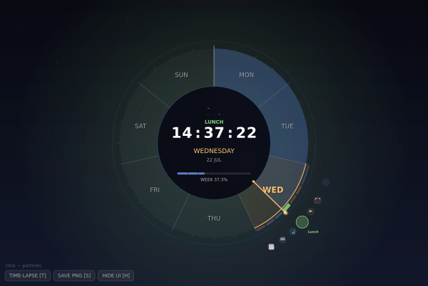
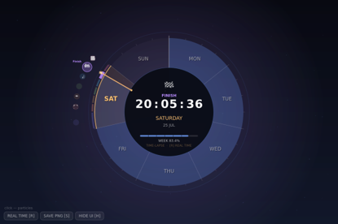
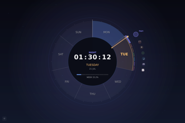

# Experiment 1- An alternative visual way to represent a realtime clock

## Brief
I have created real-time Weekly Clock. Instead of showing time on a normal 12-hour dial, it shows progress through the whole week.

## Description
Monday is placed at the top of the ring, followed by the other days clockwise until Sunday. A gold arrow takes one week to travel around the complete circle.

I wanted the position within the week to be understandable before the user reads the exact time. Days that have already passed are filled in blue, while future days remain dark. The current day is marked with a gold outline. Together, these elements show how much of the week has passed and how much is still left.

The current day also has a colour ribbon divided into seven parts of the day (including night). The active range becomes wider and brighter than the others. In the centre, the clock displays the current time, day, date and overall week percentage. PolarClock was one of my visual references because it also uses radial segments to represent units of time (Stanford Visualization Group, 2010).

The clock can run normally or in an accelerated time-lapse mode. Pressing `T` activates time-lapse, `R` returns to real time, `S` saves the canvas as a PNG and `H` hides the interface. These controls are also available as clickable buttons, which makes them usable with a mouse or touchscreen. Clicking somewhere outside the buttons creates a short particle burst.

## Techniques used
* The seven day sectors, progress fill and active-day outline are drawn with `arc()` in `PIE` mode. I used trigonometric functions to position the day labels, icons and clock hand around the same circular axis (p5.js, n.d.).
* A JavaScript `Date` object provides the local day, hour, minute, second and millisecond values (Mozilla, 2025). JavaScript numbers the week from Sunday, so I convert this into a Monday-first index. I then combine the day number with the fraction of the current day.
* The `getNow()` function acts as a single time source for the whole sketch. It returns either the real date or an accelerated virtual date. This means the drawing functions work in the same way in both modes.
* I used a `createGraphics()` buffer for the background gradient. The gradient is created once instead of being rebuilt line by line during every frame (p5.js, n.d.).
* A `Particle` class controls the ambient particles, sparks generated by each second tick and bursts created by mouse clicks. `push()` and `pop()` keep transformations and text styles inside the correct drawing sections.
* The main measurements are based on `min(width, height)`. The layout is calculated again inside `windowResized()`, allowing the clock to adapt to different screen sizes.

## Development Process
The first file, `clock_v1-baseline.js`, established the main seven-sector idea, but several parts did not work correctly. The largest problem was the week progress calculation. It used only the amount of time that had passed since midnight and divided this by the number of seconds in a week. Because the day itself was missing from the calculation, the hand could never move beyond the first sector.

  

There was also an alignment problem. The sectors began at p5.js's default zero-degree position, while the hand had a separate angle offset. This meant that the hand and the day sectors did not point to the same part of the week. The design was also overcrowded because all six day-part icons were repeated for every day. This created forty-two labels around the ring. Another inefficient part was the background gradient, which was drawn using one horizontal line for every row during every frame.

In `clock_v2-core-fixes.js`, I focused on correcting the time system before doing more visual work. Week progress was changed to `(weekday index + fraction of day) / 7`. The hand, day fills and current-day label all use this same value, so they remain connected.

  

I also introduced one `TOP_ANGLE` constant and used it for every radial element. This fixed the alignment issue without needing separate offsets in different functions. Drawing a dark centre over the sectors changed the solid pie shape into a ring. I kept the day-part icons only on the current day, which made the screen much less crowded.

The background gradient was moved into an off-screen buffer. I also fixed a problem with the particle system. In the first version, particles were removed with `splice()` inside a `for...of` loop. Removing an item while moving forwards through the array could cause the next particle to be skipped. I replaced this with reverse iteration.

Version 2 introduced the first time-lapse mode. At first, virtual time advanced by exactly five minutes on every frame. This created an unexpected result: the seconds stayed fixed and the minute display repeated a limited pattern. In clock_v3-final.js, I changed the step to 307.3 seconds. The non-round value allows every part of the digital time to visibly change during time-lapse. I also placed the time characters into fixed-width positions, preventing the central display from moving slightly when the digits change.

The day-part system needed another correction. Version 2 stored labels at selected starting hours. During the early hours of the day, the code inherited the final item in the array. The icons also showed individual starting points instead of complete time ranges.

  

I replaced this system with seven ranges beginning at midnight. Each range has its own colour, a section of the ribbon and an icon placed at the centre of that period. The active label is positioned farther away from the ring so that it does not collide with nearby icons. Finally, I added clickable controls, hover feedback and the option to hide and restore the interface. These additions did not require any changes to the main time calculation.

## Reflection
I think the clearest part of the result is the relationship between the hand, the filled ring and the percentage shown in the centre. All three are calculated from the same progress value, so the visual information stays consistent.

Time-lapse was also important. A hand that moves once per week is difficult to test or demonstrate in real time. The accelerated mode makes it possible to watch the day sectors, colour ranges and central information change within a short period. Compared with the first version, the limited use of blue for structure and gold for the present also makes the clock easier to read. The smaller day-part colours add detail without controlling the whole composition.

The design still has some limitations. On very small screens, the labels outside the ring can become crowded. A more responsive version could remove the words at smaller sizes and show only the icons. The clock also depends heavily on colour. Although the active range changes its width, users with colour-vision differences may still have difficulty separating some of the information. Patterns or stronger text labels could provide another visual cue.

If I continued working on it, I would add a setting for choosing the first day of the week. I would also consider placing personal events around the ring so that it could work as a small weekly calendar. These features were outside the scope of this experiment, so I kept the current version focused on representing time.

## Resources
* Mozilla (2025) 'Date - JavaScript'. MDN Web Docs. Available at: https://developer.mozilla.org/en-US/docs/Web/JavaScript/Reference/Global_Objects/Date (Accessed: 2 July 2026).
* p5.js (n.d.) 'arc()'. p5.js Reference. Available at: https://p5js.org/reference/p5/arc/ (Accessed: 12 July 2026).
p5.js (n.d.) 'createGraphics()'. p5.js Reference. Available at: https://p5js.org/reference/p5/createGraphics/ (Accessed: 12 July 2026).
Stanford Visualization Group (2010) 'PolarClock'. Protovis. Available at: https://mbostock.github.io/protovis/ex/clock.html (Accessed: 13 July 2026).
