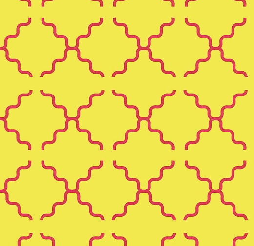
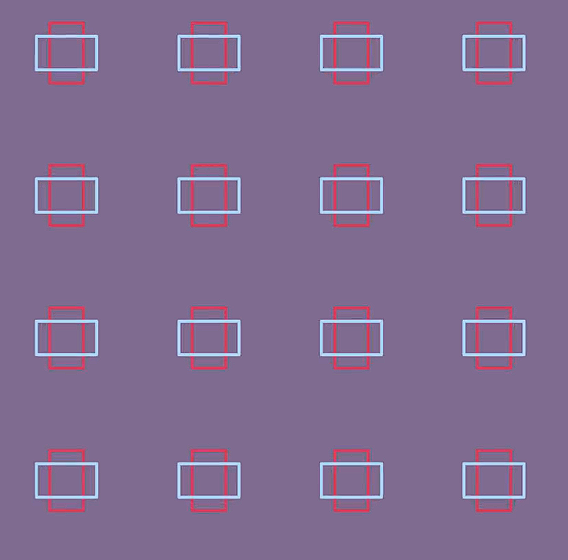
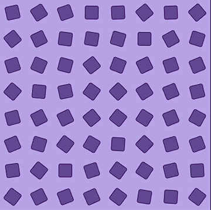
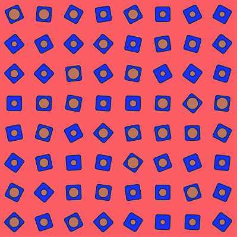
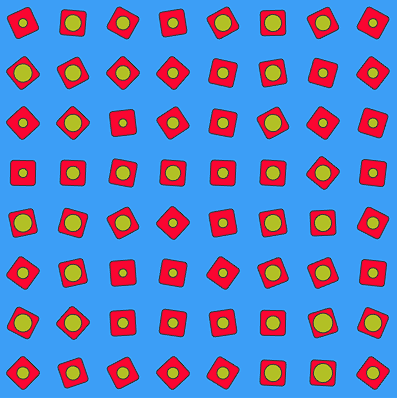
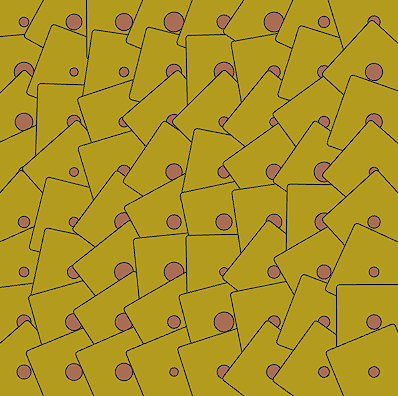
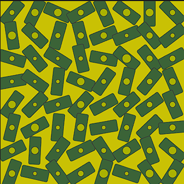
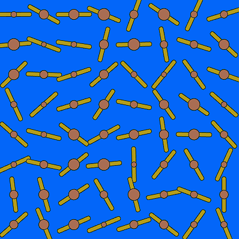

# Experiment 3 - An autonomous pattern generator that will create a rich visual effect that is different each time it is run.

## Brief
When I thought about the pattern, I recalled how I learned to make animations in After Effects, and then I was inspired by simple animated tiled patterns. And I thought I can make a similar pattern in p5.js.





My idea was that the canvas is divided into cells, forming a virtual grid. Next, an object is created that fills each cell. Then, an animation is performed in which the elements undergo a small transformation or movement, and we see an interesting visual result. I can already assume that I will use a two-dimensional array (matrix) to store the pattern elements and use loops to fill the grid with elements. I will apply randomness to some of the element's properties so that I can get a unique outcome each time.

## Description

* I created an 8x8 grid by drawing a square using a nested for loop. `rect(i * w, j * w, w, w);`
`i` and `j` increase with each iteration of their loop, thereby drawing a square in a new location.
* • I use `translate()` inside a nested loop to centre the coordinate system for each tile. 
---
* I decided to randomise the angle of rotation of the tiles when the program starts. I created an array and filled it with 8 empty arrays. Each empty array was filled with 8 random numbers from 0 to 360 (random rotation angle). This gave me a matrix of 64 numbers, which corresponds to the starting 8x8 grid. 

`matrix[i][j] = random(0, 360)`



* Next, each tile rotates to its maximum angle and stops smoothly. We now have a unique pattern.

* Next, I added a second matrix of circles so that each circle lies in the centre of a square, and with each new click, the sizes of the circles change.
```
function mousePressed() {
circleSize[i][j] = random(w/6, w/2.5);
}
```
Then, using the `random()` and `colour()` functions, I made the background colours of the square and round tiles random.
```
bg = colour(random(0, 255), random(0, 255), random(0, 255));
rectBG = colour(random(0, 255), random(0, 255), random(0, 255));
circleColour = colour(random(0, 255), random(0, 255), random(0, 255));
```




* I also thought, why not add the ability to customise the pattern in real time? I set the `mouseX` and `mouseY` variables instead of the height and width of the square tile.
As a result, the tiles have different rotation angles, unique colours and shapes that change in real time by moving and clicking the mouse.





## Reflection


