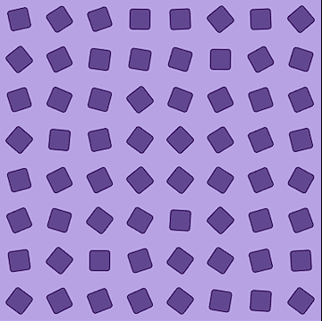
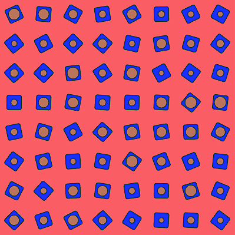
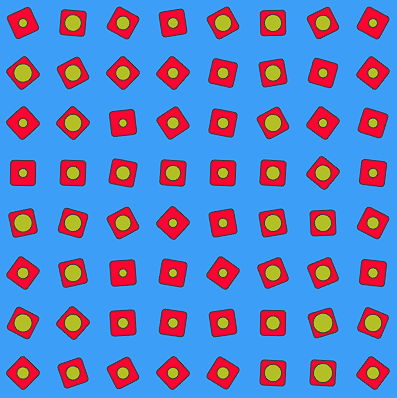
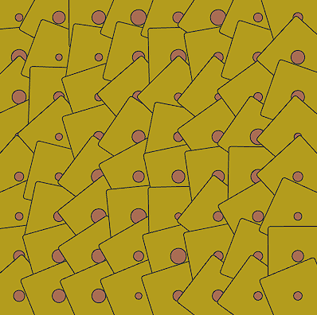
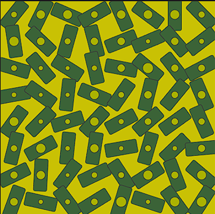
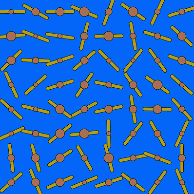

# Experiment 3 - An autonomous pattern generator that will create a rich visual effect that is different each time it is run

## Brief
I have created a pattern generator that produces different visual result each time it runs, and is customisable.

My idea was to divide the canvas into cells, creating a virtual grid. Each cell would contain the same basic object, but some of its properties would change. I planned to use a two-dimensional array to store information for each tile and nested loops to draw the grid. Randomness would then be applied to properties such as rotation, size or colour, allowing the program to create a different outcome each time.

## Description
I began by creating an 8 × 8 grid of square tiles. Two nested `for` loops control the rows and columns, while `w = width / rows` calculates the width of each cell. The values of `i` and `j` increase during each loop, so every square is drawn in a new position.

The rotation angles are stored in a two-dimensional array called `matrix`. It contains eight smaller arrays, each holding eight randomly generated numbers between 0 and 360. This gives the program 64 target angles, one for every tile. Two-dimensional arrays are useful here because each value can be accessed using its row and column position (Processing Foundation, n.d.).

Inside the nested loop, I use `translate()` to move the coordinate system to the centre of the current cell. The square can then be drawn at `(0, 0)` and rotated around its own centre. `push()` and `pop()` keep each transformation inside its tile, preventing it from affecting the rest of the grid (Eisenberg, n.d.; p5.js Contributors, n.d.).

```javascript
translate(i * w + 25, j * w + 25);
rect(0, 0, w / 2, w / 2, 3);
```

When the sketch starts, the shared `angle` value gradually increases. Each square rotates until its assigned value from `matrix[i][j]` is reached, then it stops. Because the target values are selected with `random(0, 360)`, every run creates a different arrangement (p5.js Contributors, n.d.).

<br>
<div align="center">
    
</div>
<br>

In the second version, I added another 8 × 8 array called `circleSize`. A circle is placed in the centre of every square, and the array stores its size. Clicking the mouse generates new colour values for the background, rectangles and circles. It also rebuilds the `circleSize` array with new random values.

```javascript
function mousePressed() {
    bg = color(random(0, 255), random(0, 255), random(0, 255));
    rectBG = color(random(0, 255), random(0, 255), random(0, 255));
    circleColour = color(random(0, 255), random(0, 255), random(0, 255));
}
```
<br>
<div align="center">
    
    
</div>
<br>

I also wanted the pattern to respond while it was running. I replaced the fixed rectangle dimensions with `mouseX / 10` and `mouseY / 7`. Moving the cursor horizontally changes the width of the tiles, while vertical movement changes their height. The result can therefore be adjusted in real time instead of being controlled only by the initial random values.

## Techniques Used
- Nested `for` loops to draw an 8 × 8 grid.
- Two-dimensional arrays for storing rotation angles and circle sizes.
- `random()` for angles, sizes and RGB colour values.
- `translate()` and `rotate()` for positioning and rotating individual tiles.
- `push()` and `pop()` to isolate transformations.
- A gradually increasing angle value for the opening animation.
- `mouseX` and `mouseY` for changing tile dimensions.
- `mousePressed()` for generating new colours and circle sizes.

## Development Process
In `pattern-gen_v1.js`, I focused on building the grid and making each square stop at a different rotation. The main difficulty was rotating every tile around its own centre. Drawing all the squares in the normal canvas coordinate system made this awkward. Moving the origin into each cell with `translate()` allowed me to draw and rotate the square locally.

The first version already created a different result each time, but it was visually quite limited. It only used squares and had a fixed purple colour scheme. Once the rotation finished, there was also very little for the user to do.

For `pattern-gen_v2-final.js`, I kept the original grid and rotation system but added circles as a second visual layer. The `circleSize` array gave each circle a separate size, while `mousePressed()` allowed new colour combinations and circle sizes to be generated without restarting the sketch.

<br>
<div align="center">
    
    
    
</div>
<br>

My last change was connecting the rectangle dimensions to the mouse position. I preferred this result because it made the pattern more interactive. The random values still create an unpredictable starting point, but the user can continue changing the shapes afterwards.

## Reflection

I managed to create a pattern generator that is simple to use and produces many different combinations of colours, rotations and shapes. The opening rotation gives each new run a short animation, and the mouse controls make it interesting to test different results.

The most important techniques were two-dimensional arrays, nested loops and `random()`. Together, they allowed me to control 64 tiles without writing separate code for each one.

I did not create the continuously animated pattern that I first imagined. I spent more time developing ways to change the completed pattern with the mouse. If I continued the experiment, I would try more shapes and transformations. I would also test `noise()`, as it produces smoother changes between nearby values than `random()` (p5.js Contributors, n.d.).

## Sources

* Eisenberg, J.D. (n.d.) *2D Transformations*. Processing. Available at: [https://processing.org/tutorials/transform2d/](https://processing.org/tutorials/transform2d/) (Accessed: 12 July 2026).
* Processing Foundation (n.d.) *Array 2D*. Processing. Available at: [https://processing.org/examples/array2d](https://processing.org/examples/array2d) (Accessed: 12 July 2026).
* p5.js Contributors (n.d.) *p5.js Reference*: [`random()`](https://p5js.org/reference/p5/random/), [`translate()`](https://p5js.org/reference/p5/translate/), [`rotate()`](https://p5js.org/reference/p5/rotate/), [`push()`](https://p5js.org/reference/p5/push/), [`pop()`](https://p5js.org/reference/p5/pop/) and [`noise()`](https://p5js.org/reference/p5/noise/) (Accessed: 10 July 2026).
